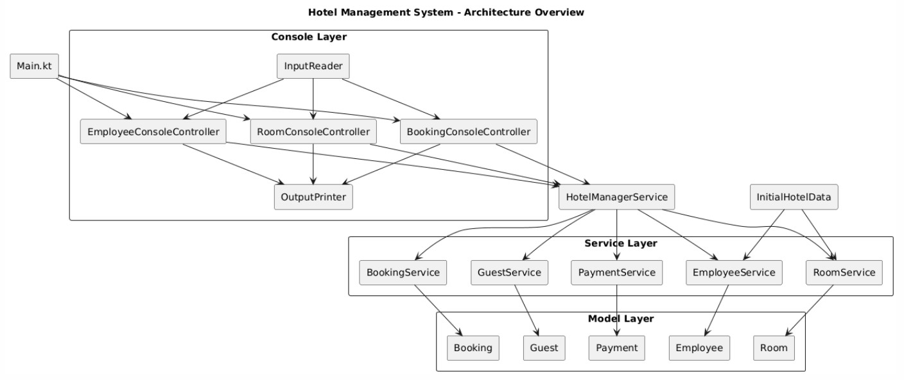

# 🏨 Hotel Management System (Basic)

## 💡 Giới thiệu
Ứng dụng **Quản lý Khách sạn** được viết bằng **Kotlin**, chạy trên **console**.  
Hệ thống mô phỏng các nghiệp vụ cơ bản trong khách sạn: **quản lý phòng, khách hàng, đặt phòng, thanh toán và nhân viên.**  
Dành cho **lễ tân (Receptionist)** và **quản lý khách sạn (Manager)**.

---

## 👩‍💼 Phân quyền sử dụng

### 🧾 Lễ tân (Receptionist)
- Xem danh sách phòng
- Tìm kiếm phòng theo ID
- Check-in (đặt phòng)
- Check-out (trả phòng, thanh toán)
- Sắp xếp phòng theo giá

### 🧑‍💼 Quản lý (Manager)
Bao gồm tất cả quyền của lễ tân **và thêm quyền quản trị:**
- Thêm / xóa / chỉnh sửa thông tin phòng
- Thêm / sửa / xóa nhân viên
- Xem danh sách nhân viên

---

## ⚙️ Chức năng chính

- **Quản lý Phòng:** thêm, xóa, sửa, tìm kiếm, sắp xếp
- **Quản lý Khách:** lưu thông tin khách, tự động tạo khi check-in
- **Đặt Phòng:** check-in, check-out, quản lý trạng thái
- **Thanh Toán:** tự động sinh hóa đơn, hỗ trợ nhiều phương thức
- **Quản lý Nhân viên:** đăng nhập, phân quyền, chỉnh sửa thông tin

---

### 🏗️ Kiến trúc tổng thể

## 🧱 Cấu trúc Dự án

summarytask12/
├── console/
│ ├── controller/ # Xử lý logic nhập/xuất cho Room, Booking, Employee
│ ├── input/ # InputReader - đọc dữ liệu người dùng
│ └── output/ # OutputPrinter - hiển thị menu, danh sách, kết quả
│
├── data/ # Dữ liệu mẫu ban đầu (InitialHotelData)
├── manager/ # HotelManagerService - điều phối trung tâm
├── message/ # MessagesInput / MessagesOutput - thông báo hệ thống
├── model/ # Lớp mô hình dữ liệu (Room, Booking, Guest, Payment, ...)
├── service/ # Lớp nghiệp vụ (RoomService, BookingService, ...)
└── main/ # Main.kt - khởi chạy chương trình, hiển thị menu

## ▶️ Cách chạy chương trình
1. Mở dự án trong IDE.
2. Chạy file **`Main.kt`** tại:
   src/main/kotlin/com/example/summarytask12/main/Main.kt
3. Đăng nhập bằng **ID nhân viên mẫu** (ví dụ: `M01` hoặc `E01`).
4. Làm theo hướng dẫn trong **menu console** để thao tác theo vai trò.
